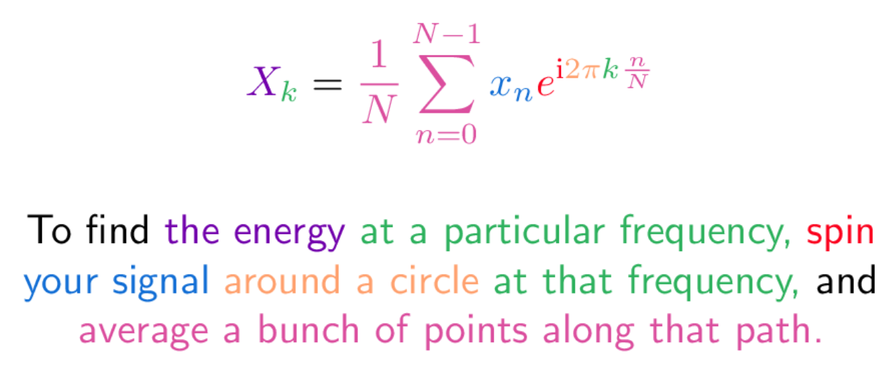

# Interesting
A few people (@[jemoka](https://www.jemoka.com), @[exr0n](http://www.exr0n.com), @[quantumish](https://richardfeynmanrocks.github.io), @rombutan and @[Ban-Ironic-Ohms](https://github.com/Ban-Ironic-Ohms) thus far) started this website to stop crowding DMs with mildly-interesting-internets. Its a lovely link tree of things that we find interesting, or just random stuff on the internet.

It's like a microblog, but published in a single markdown file. Cool, right? Also, if you want, you could commit to this doc too! Just [make a PR](https://github.com/Jemoka/interesting) or [email @jemoka](mailto:hliu@shabang.cf).

## Computer Science
### General Coolness
- [The Iceburg of Rabitty Rabithole ness](https://suricrasia.online/iceberg/).
- This whole thing also turned out to be an excercise in rapid-fire soydevery

### C++
- [Raytracing with CMake](https://64.github.io/cmake-raytracer/)
- [How do C++20 modules work?](https://vector-of-bool.github.io/2019/03/10/modules-1.html)

### Python
- [Static duck typing (structural typing)](https://glyph.twistedmatrix.com/2020/07/new-duck.html)
    * But [pyright](https://github.com/microsoft/pyright) > mypy

### Lisp
- [Simple but refined, guaranteed to blow your mind. Bum, ba bum.](http://landoflisp.com/).
- [The only copy of On Lisp in the penninsula is a japanese translation at SFPL](https://sfpl.bibliocommons.com/item/show/3660332093) 
- [Muahahahah lisp transpiles into JS](https://common-lisp.net/project/parenscript/)
- [Apparently Lisp happened because John McCarthy gave up writing a language after writing its AST](https://qr.ae/pG2AOR)
- "`defun` is where fun is taken away from you" --- Adam, 2021
- [Don't want to learn lisp? Bam! You get Windows!](http://www.paulgraham.com/iflisp.html) 
- [Electron for lisp](https://rabbibotton.github.io/clog/clog-manual.html#x-28CLOG-3A-40CLOG-GETTING-STARTED-20MGL-PAX-3ASECTION-29) _does_ exist! 
 
### Vim
- Someone really wants to start R 

### Apple
- You realize that all the dub-dub artwork feature lots of neckless/bodiless people, right? 
    * I could never got over this fact
    * It's been _two years_
    * Like, does [this hero image](https://developer.apple.com/wwdc21/swift-student-challenge/) not creep you out? 

<<<<<<< HEAD
## Hardware
- Commercial Stuff
    * Intel Might enable FidelityFX in Xe-HPG GPU's
    * New 3080 Ti
    * DDR5 ram is trickling down
- Hobby Stuff
    * [C64 watch lol](https://hackaday.com/2021/06/02/commodore-inspired-watch-puts-basic-on-your-wrist/)
    * [New CM4 carrier boards every day](https://pipci.jeffgeerling.com/boards_cm)
    * [Some guy was able to down- and up- load firmware to the airtags](https://www.youtube.com/watch?v=_E0PWQvW-14)
=======
### Git?
- Github got rid of access controls for non-orgs. Scandelous! 

### Pi Hole
- Pi Hole is showing me who is pinging back home.

- I dislike Adobe

### shell scripting
- Why zsh is actually better: parameter expansion

### corporate shrilling
- [Stack Overflow (big tech) sold out to Prosus (even bigger tech)](https://www.wsj.com/articles/software-developer-community-stack-overflow-sold-to-tech-giant-prosus-for-1-8-billion-11622648400)
>>>>>>> 63d26893e07f69187abb1805c3d564e5d454ef9b

## Muzak
- [No Water in the Water fountain. **One Potato, Ten Straws, SCIENCE, in ACTION!**](https://www.youtube.com/watch?v=jbiFcPhccu8)

## Places
### Kunming
- [Elephants in Kunming!](https://www.scmp.com/news/china/science/article/3135331/chinese-elephant-herd-hits-road-quest-through-urban-jungle). *UPDATE:* [they got there](https://www.nbcnews.com/news/world/herd-wild-elephants-approaches-chinese-city-after-300-mile-journey-n1269293)
<<<<<<< HEAD
=======

## Chemistry?
- Other people may already know this but is LSD "safer" than Caffine???? This graph is either misleading or I have a misconception  -- @Jemoka

## MAFF

### cool visualizations

- [colorizing equations](https://betterexplained.com/articles/colorized-math-equations/), especially this one about the discrete fourier transform

## General Internets
- [Yes! Yes! Yes! You get a hotdog! You get a hotdog! Every! Body! Gets! A! Hotdog!](https://www.youtube.com/watch?v=Ziu2rrNS7S0)

## Inside Jokes
- Micah trying to figure out how markdown works 

>>>>>>> 63d26893e07f69187abb1805c3d564e5d454ef9b
